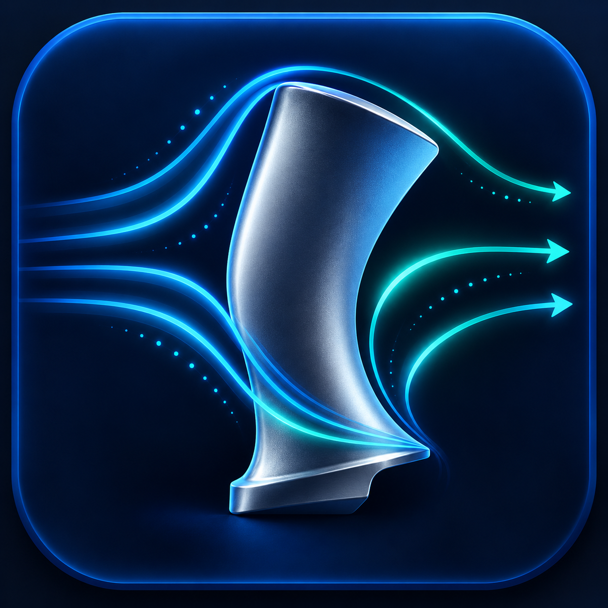

# Engineering MCP Extensions for VS Code

Connect VS Code Copilot Chat to Ansys simulation software with three carefully scoped Model Context Protocol (MCP) integrations. Each package includes its own custom marketplace icon, installation guide, and direct setup command.

**Project site:** [engineering-mcp-extensions](https://outblade.github.io/engineering-mcp-extensions/)

| Lumerical | Mechanical | Fluent |
| --- | --- | --- |
|  |  |  |

Three focused VS Code integrations that register Ansys-maintained MCP servers in VS Code's native MCP catalog:

| Extension | Ansys product | MCP server |
| --- | --- | --- |
| Ansys Lumerical MCP | Photonics simulation (FDTD, MODE, DEVICE, INTERCONNECT) | [ansys/pylumerical-mcp](https://github.com/ansys/pylumerical-mcp) |
| Ansys Mechanical MCP | Structural, thermal, and modal simulation | [ansys/pymechanical-mcp](https://github.com/ansys/pymechanical-mcp) |
| Ansys Fluent MCP | CFD and fluid simulation | [ansys/pyfluent-mcp](https://github.com/ansys/pyfluent-mcp) |

Each extension contributes a native VS Code MCP server provider. Install [uv](https://docs.astral.sh/uv/) (provides `uvx`) and Git first. On first start, `uvx` fetches the corresponding server from Ansys' public GitHub repository. The local Ansys product and a valid license are still needed for solver operations. Check each server's upstream documentation for its supported Python and product versions.

These are integration extensions, not replacements for Ansys software or the upstream MCP servers. They do not include binaries, fetch anything until the MCP server is started, or ask for credentials. The wrapper code is MIT licensed; each upstream server retains its own license and requirements.

## VS Code support

VS Code's MCP extension API is required. Install the extension, open the Chat view, open the tools/MCP picker, and start the named server. If you prefer project configuration, each folder README includes the equivalent `.vscode/mcp.json` entry.

## Building VSIX packages

From each extension directory, run `npx --yes @vscode/vsce package`. The produced `.vsix` can be installed locally with `code --install-extension <file.vsix>`.

## Publishing

Publishing follows the GDS Inspector release flow. Once the two publisher credentials are saved as repository Actions secrets, a `vscode-v<version>` tag automatically packages all three extensions, attaches the VSIX files to a GitHub Release, and publishes them to the VS Code Marketplace and Open VSX. A manual workflow run is available for first publication or recovery. If a store credential is missing, the GitHub Release still provides installable VSIX files and the workflow reports which store is pending.

Set up the repository secrets once:

- `VSCE_PAT`: a Microsoft Marketplace token with the **Marketplace: Manage** scope.
- `OVSX_PAT`: an Open VSX access token. The publisher agreement must be accepted in the Open VSX account before publishing.

Never put either token in source control or chat. Future releases need only a version bump and a `vscode-v<same-version>` tag; no one needs to package or upload each extension by hand.
